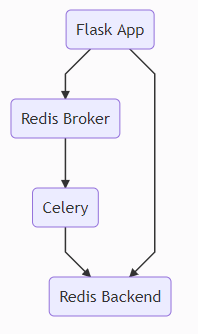

# image_to_thumbnail

## To Start the application

```
docker-compose up -d --build
```

## API ENDPOINTS

### For converting the image to thumbnail

* URL

  /convertImage

* Method

  `POST`

* Data Params

  request.json <sample image in base64>

* Response

  * Code: 202
    Content: {"success": true, "token": "<uuid>"}

* Sample Call

  curl -H "Content-Type: application/json" -d @request.json http://localhost:5000/convertImage

### For getting the status

* URL

  /status

* Method

  `GET`

* URL Params

  <token>

* Response

  * Code: 200
    Content: {"resizedImageName": <converted/image/jpg>, "status": "success"}

* Sample Call

  curl http://localhost:5000/status/<token>

### Dependencies

* `flask` - micro web application framework, makes getting started quick and easy. Using the inbuilt server too.
* `pillow` - python imaging library, used for converting the image to thumbnail.
* `celery` - distributed task queue used for asynchronous task processing
* `redis` - used as a message broker as well as the result backend for celery to communicate with the flask server.
* `pytest` - used to inject/mock testing configuration while instantiating the app.
* `requests` - using http requests to access backend endpoint in unit test

### To run test

Create and activate virtual environment then run the following command.

```
pip install -r requirements.txt
python -m pytest
```

## Architecture

